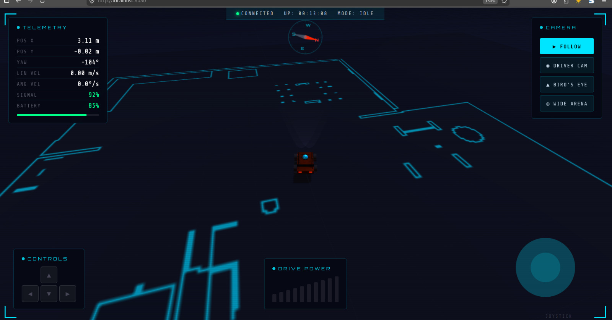
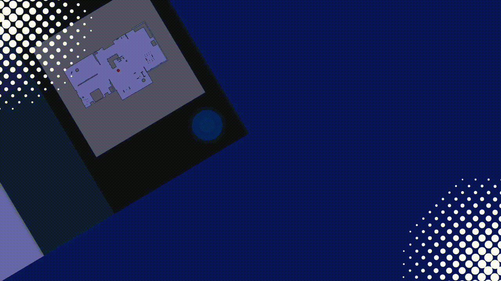

# Delivery Robot — ROS2 Jazzy

An autonomous indoor delivery robot built with ROS2 Jazzy, Nav2, and Gazebo Harmonic.  
Features a mecanum-wheel holonomic drive, SLAMTEC LIDAR, EKF sensor fusion, and a web-based navigation interface.

  

---

## Demo

### Autonomous Navigation


### EKF Sensor Fusion


### Web Interface


### Delivery Bringup


---

## Requirements

- Ubuntu 24.04 Noble
- ROS2 Jazzy
- Gazebo Harmonic

---

## Installation

**Clone with submodules**

```bash
mkdir -p ~/ros2_ws/src && cd ~/ros2_ws/src
git clone --recurse-submodules https://github.com/mohmedatwa/delivery_robot.git
```

**Install dependencies**

```bash
cd ~/ros2_ws
sudo rosdep init && rosdep update
rosdep install --from-paths src --ignore-src -r -y
```

**Build**

```bash
colcon build --symlink-install --cmake-args -DCMAKE_BUILD_TYPE=Release
source install/setup.bash
```

---

## Simulation

```bash
ros2 launch delivery_bringup simulated_delivery_robot.launch.py \
  world_name:=warehouse \
  map:=warehouse \
  use_sim_time:=true
```

After launch, set the robot's initial pose in RViz2 using **2D Pose Estimate**, then send goals with the **Nav2 Goal** tool.

---

## Web Interface

```bash
ros2 launch web_server web_server.launch.py
```

Open `http://localhost:8000` for live map view and goal sending.

---

## Hardware Bringup

```bash
ros2 launch delivery_bringup hardware_delivery_robot.launch.py
```

---

## Project Structure

```
delivery_robot/
├── delivery_bringup/
├── delivery_controller/
├── delivery_description/
├── delivery_firmware/
├── delivery_localization/
├── delivery_navigation/
├── delivery_scripts/
├── delivery_twist/
├── delivery_utils/
├── web_nav_bridge/
├── web_server/
├── sllidar_ros2/
├── Docker/
├── media/
├── .gitmodules
├── LICENSE
└── README.md
```

---

## Contributors

- **Mohamed Atwa** — [@mohmedatwa](https://github.com/mohmedatwa)
- **Abdullah Mohamed** — [@mohamed12345abdullah](https://github.com/mohamed12345abdullah)
- **Zeyad Khaled** — [@ZeyadKhaled70](https://github.com/ZeyadKhaled70)
- **Kero Mounir** — [@kmounir144](https://github.com/kmounir144)
- **Abdelkarim Abady** — [@Abdelkarim13](https://github.com/Abdelkarim13)

---

## License

MIT — see [LICENSE](LICENSE) for details.
